# GEM: Graph Embedding Methods
GEM is a Python module that implements many graph (a.k.a. network) embedding algorithms. GEM is distributed under BSD license.

The module was developed and is maintained by Palash Goyal.

## Implemented Methods
GEM implements the following graph embedding techniques:
* [Laplacian Eigenmaps](http://yeolab.weebly.com/uploads/2/5/5/0/25509700/belkin_laplacian_2003.pdf)
* [Locally Linear Embedding](http://www.robots.ox.ac.uk/~az/lectures/ml/lle.pdf)
* [Graph Factorization](https://static.googleusercontent.com/media/research.google.com/en//pubs/archive/40839.pdf)
* [Higher-Order Proximity preserved Embedding (HOPE)](http://www.kdd.org/kdd2016/papers/files/rfp0184-ouA.pdf)
* [Structural Deep Network Embedding (SDNE)](http://www.kdd.org/kdd2016/papers/files/rfp0191-wangAemb.pdf)
* [node2vec](http://www.kdd.org/kdd2016/papers/files/rfp0218-groverA.pdf)

A survey of these methods can be found in [Graph Embedding Techniques, Applications, and Performance: A Survey](https://arxiv.org/abs/1705.02801).

## Graph Format
We store all graphs using the [DiGraph](http://networkx.readthedocs.io/en/networkx-1.11/reference/classes.digraph.html) as **directed weighted graph** in python package networkx. The weight of an edge is stored as attribute "weight". We save each edge in undirected graph as two directed edges.

The graphs are saved using `nx.write_gpickle` in the networkx format and can be loaded by using `nx.read_gpickle`.

## Repository Structure
* **gem/embedding**: existing approaches for graph embedding, where each method is a separate file
* **gem/evaluation**: evaluation tasks for graph embedding, including graph reconstruction, link prediction, node classification and visualization
* **gem/utils**: utility functions for graph manipulation, evaluation and etc.
* **gem/data**: input test graph (currently has [Zachary's Karate graph](https://en.wikipedia.org/wiki/Zachary%27s_karate_club))
* **gem/c_src**: source files for methods implemented in C++
* **gem/c_ext**: Python interface for source files in c_src using [Boost.Python](http://www.boost.org/doc/libs/1_64_0/libs/python/doc/html/index.html)

## Dependencies
GEM is tested to work on Python 2.7 and Python 3.6

The required dependencies are: Numpy >= 1.12.0, SciPy >= 0.19.0, Networkx == 1.11, Scikit-learn >= 0.18.1.

To run SDNE, GEM requires Theano >= 0.9.0 and Keras = 2.0.2.

In case of Python 3, make sure it was compiled with `./configure --enable-shared`, and that you have `/usr/local/bin/python` in your `LD_LIBRARY_PATH`.

## Install
The package uses setuptools, which is a common way of installing python modules. To install in your home directory, use:
```bash
    python setup.py install --user
```

To install for all users on Unix/Linux:
```bash 
    sudo python setup.py install
```

You also can use `python3` instead of `python`.

To install node2vec as part of the package, recompile from https://github.com/snap-stanford/snap and add node2vec executable to system path.
To grant executable permission, run: chmod +x node2vec

## Usage
### Example 1
Run the methods on Karate graph and evaluate them on graph reconstruction and visualization. The data is located in examples/data. The example can be run from examples folder as python test_karate.py -node2vec 0 (use -node2vec 1 to also run node2vec model):

```python
import matplotlib.pyplot as plt

from gem.utils import graph_util, plot_util
from gem.evaluation import visualize_embedding as viz
from gem.evaluation import evaluate_graph_reconstruction as gr
from time import time

from gem.embedding.gf       import GraphFactorization
from gem.embedding.hope     import HOPE
from gem.embedding.lap      import LaplacianEigenmaps
from gem.embedding.lle      import LocallyLinearEmbedding
from gem.embedding.node2vec import node2vec
from gem.embedding.sdne     import SDNE

# File that contains the edges. Format: source target
# Optionally, you can add weights as third column: source target weight
edge_f = 'karate.edgelist'
# Specify whether the edges are directed
isDirected = True

# Load graph
G = graph_util.loadGraphFromEdgeListTxt(edge_f, directed=isDirected)
G = G.to_directed()

models = []
# You can comment out the methods you don't want to run
# GF takes embedding dimension (d), maximum iterations (max_iter), learning rate (eta), regularization coefficient (regu) as inputs
models.append(GraphFactorization(d=2, max_iter=100000, eta=1*10**-4, regu=1.0))
# HOPE takes embedding dimension (d) and decay factor (beta) as inputs
models.append(HOPE(d=4, beta=0.01))
# LE takes embedding dimension (d) as input
models.append(LaplacianEigenmaps(d=2))
# LLE takes embedding dimension (d) as input
models.append(LocallyLinearEmbedding(d=2))
# node2vec takes embedding dimension (d),  maximum iterations (max_iter), random walk length (walk_len), number of random walks (num_walks), context size (con_size), return weight (ret_p), inout weight (inout_p) as inputs
models.append(node2vec(d=2, max_iter=1, walk_len=80, num_walks=10, con_size=10, ret_p=1, inout_p=1))
# SDNE takes embedding dimension (d), seen edge reconstruction weight (beta), first order proximity weight (alpha), lasso regularization coefficient (nu1), ridge regreesion coefficient (nu2), number of hidden layers (K), size of each layer (n_units), number of iterations (n_ite), learning rate (xeta), size of batch (n_batch), location of modelfile and weightfile save (modelfile and weightfile) as inputs
models.append(SDNE(d=2, beta=5, alpha=1e-5, nu1=1e-6, nu2=1e-6, K=3, n_units=[50, 15,], n_iter=50, xeta=0.01, n_batch=500,
                modelfile=['enc_model.json', 'dec_model.json'],
                weightfile=['enc_weights.hdf5', 'dec_weights.hdf5']))

for embedding in models:
    print ('Num nodes: %d, num edges: %d' % (G.number_of_nodes(), G.number_of_edges()))
    t1 = time()
    # Learn embedding - accepts a networkx graph or file with edge list
    Y, t = embedding.learn_embedding(graph=G, edge_f=None, is_weighted=True, no_python=True)
    print (embedding._method_name+':\n\tTraining time: %f' % (time() - t1))
    # Evaluate on graph reconstruction
    MAP, prec_curv, err, err_baseline = gr.evaluateStaticGraphReconstruction(G, embedding, Y, None)
    #---------------------------------------------------------------------------------
    print(("\tMAP: {} \t precision curve: {}\n\n\n\n"+'-'*100).format(MAP,prec_curv[:5]))
    #---------------------------------------------------------------------------------
    # Visualize
    viz.plot_embedding2D(embedding.get_embedding(), di_graph=G, node_colors=None)
    plt.show()
```

The output of the above execution is:
```
---------graph_factor_sgd:
    Training time: 0.459782 MAP: 0.418189831501 precision curve: [1.0, 0.5, 0.6666666666666666, 0.5, 0.4]

---------hope_gsvd:
    Training time: 0.002792 MAP: 0.834648134445 precision curve: [1.0, 1.0, 1.0, 1.0, 1.0]

---------lap_eigmap_svd:
    Training time: 0.015966 MAP: 0.511774195685 precision curve: [1.0, 1.0, 0.6666666666666666, 0.5, 0.4]

---------lle_svd:
    Training time: 0.017661 MAP: 0.625323321278 precision curve: [1.0, 1.0, 0.6666666666666666, 0.5, 0.4]

---------node2vec_rw:
    Training time: 0.335455 MAP: 0.402896048616 precision curve: [0.0, 0.5, 0.3333333333333333, 0.25, 0.2]

---------sdne:
    Training time: 13.969912 MAP: 0.635860976597 precision curve: [0.0, 0.0, 0.0, 0.25, 0.4]
```
We observe that HOPE, LLE and SDNE achieve high MAP values. Furthermore, HOPE can predict top 5 links with perfect accuracy.

#### Visualization of Karate graph using Graph Factorization
<p align="center">
  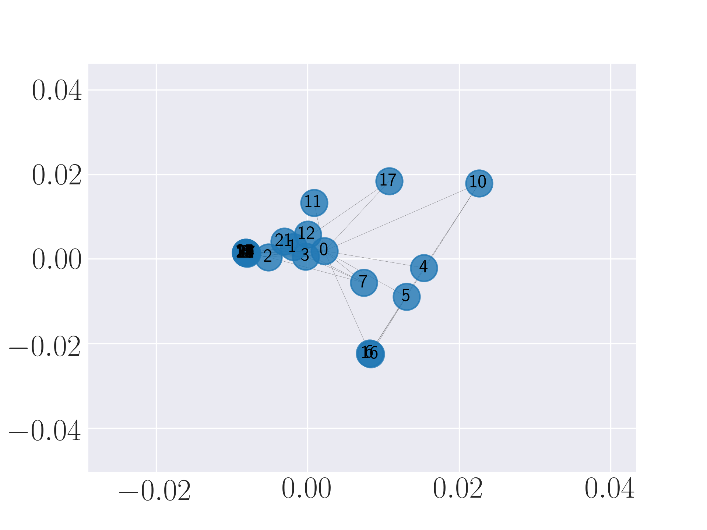
</p>

#### Visualization of Karate graph using HOPE
<p align="center">
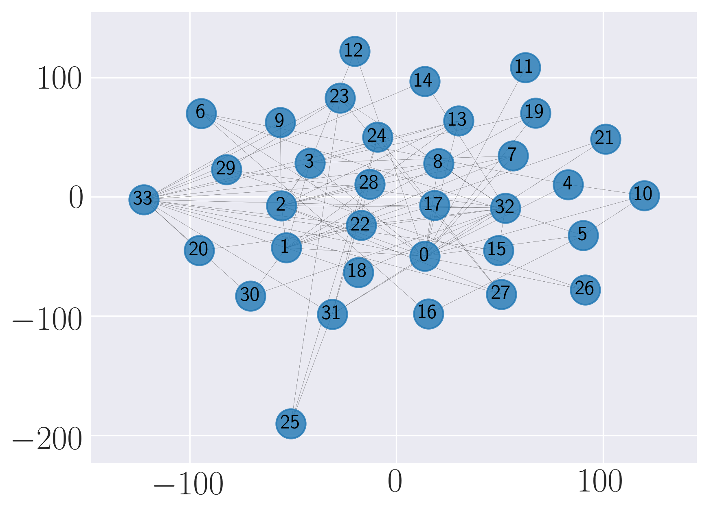

#### Visualization of Karate graph using Laplacian Eigenmaps
<p align="center">
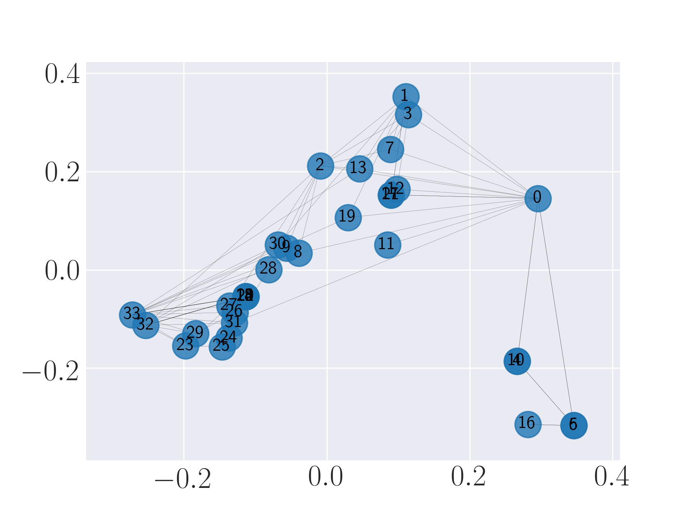

#### Visualization of Karate graph using Locally Linear Embedding
<p align="center">
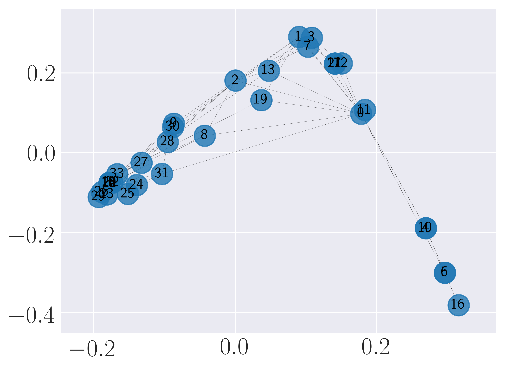

#### Visualization of Karate graph using node2vec
<p align="center">
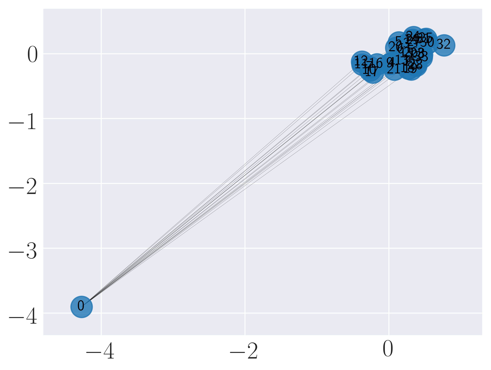

#### Visualization of Karate graph using SDNE
<p align="center">
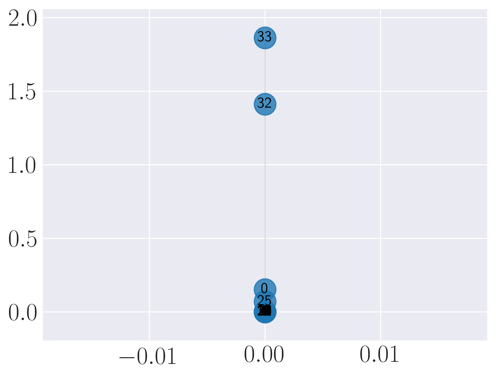

We observe from the visualizations that Locally Linear Embedding and Laplacian Eigenmaps  attempt  to  preserve  the  community  structure  of  the graph and cluster nodes with high intra-cluster edges together. Graph Factorization embeds communities very closely and keeps leaf nodes far away from other nodes.  HOPE embeds  nodes  with low  Katz  similarity  in  the  original graph farthest apart (considering dot product similarity). node2vec and SDNE preserve a mix of  community  structure  and  structural  property  of  the  nodes. In SDNE, nodes 32 and 33, which are both high degree hubs and central in  their  communities,  are  embedded  together  and  away  from low  degree  nodes.   Also,  they  are  closer  to  nodes  which  belong to their communities. SDNE embeds node 0, which acts as a bridge between communities, far away from other nodes. Note that, unlike for other methods, it does not imply that node 0 is disconnected from the rest of the nodes.  The implication here is that SDNE identifies node 0 as a separate type of node and encodes its connection to other nodes in encoder and decoder. Note that different runs of the algorithms may give different embeddings and visualizations but the properties preserved by the embeddings for a method are similar.

### Example 2
Run the graph embedding methods on Stochastic Block Model graph and evaluate them on graph reconstruction and visualization. The data is located in examples/data.  The example can be run from examples folder as python test_sbm.py -node2vec 0 (use -node2vec 1 to also run node2vec model):

```python
import matplotlib.pyplot as plt
from time import time
import networkx as nx
try: import cPickle as pickle
except: import pickle
import numpy as np

from gem.utils      import graph_util, plot_util
from gem.evaluation import visualize_embedding as viz
from gem.evaluation import evaluate_graph_reconstruction as gr

from gem.embedding.gf       import GraphFactorization
from gem.embedding.hope     import HOPE
from gem.embedding.lap      import LaplacianEigenmaps
from gem.embedding.lle      import LocallyLinearEmbedding
from gem.embedding.node2vec import node2vec
from gem.embedding.sdne     import SDNE


# File that contains the edges. Format: source target
# Optionally, you can add weights as third column: source target weight
file_prefix = 'sbm.gpickle'
# Specify whether the edges are directed
isDirected = True

# Load graph
G = nx.read_gpickle(file_prefix)
node_colors = pickle.load(
    open('sbm_node_labels.pickle', 'rb')
)
node_colors_arr = [None] * node_colors.shape[0]
for idx in range(node_colors.shape[0]):
    node_colors_arr[idx] = np.where(node_colors[idx, :].toarray() == 1)[1][0]

models = []
# Load the models you want to run
models.append(GraphFactorization(d=128, max_iter=1000, eta=1 * 10**-4, regu=1.0, data_set='sbm'))
models.append(HOPE(d=256, beta=0.01))
models.append(LaplacianEigenmaps(d=128))
models.append(LocallyLinearEmbedding(d=128))
models.append(node2vec(d=182, max_iter=1, walk_len=80, num_walks=10, con_size=10, ret_p=1, inout_p=1, data_set='sbm'))
models.append(SDNE(d=128, beta=5, alpha=1e-5, nu1=1e-6, nu2=1e-6, K=3,n_units=[500, 300,], rho=0.3, n_iter=30, xeta=0.001,n_batch=500,
                modelfile=['enc_model.json', 'dec_model.json'],
                weightfile=['enc_weights.hdf5', 'dec_weights.hdf5']))
# For each model, learn the embedding and evaluate on graph reconstruction and visualization
for embedding in models:
    print ('Num nodes: %d, num edges: %d' % (G.number_of_nodes(), G.number_of_edges()))
    t1 = time()
    # Learn embedding - accepts a networkx graph or file with edge list
    Y, t = embedding.learn_embedding(graph=G, edge_f=None, is_weighted=True, no_python=True)
    print (embedding._method_name+':\n\tTraining time: %f' % (time() - t1))
    # Evaluate on graph reconstruction
    MAP, prec_curv, err, err_baseline = gr.evaluateStaticGraphReconstruction(G, embedding, Y, None)
    #---------------------------------------------------------------------------------
    print(("\tMAP: {} \t precision curve: {}\n\n\n\n"+'-'*100).format(MAP,prec_curv[:5]))
    #---------------------------------------------------------------------------------
    # Visualize
    viz.plot_embedding2D(embedding.get_embedding(), di_graph=G, node_colors=node_colors_arr)
    plt.show()
    plt.clf()
```

The output of the above execution is:
```
---------graph_factor_sgd:
    Training time: 29.737146 MAP: 0.277151904249 precision curve: [0.0, 0.0, 0.0, 0.25, 0.4]

---------hope_gsvd:
    Training time: 0.958994 MAP: 0.890902438959 precision curve: [1.0, 1.0, 1.0, 1.0, 1.0]

---------lap_eigmap_svd:
    Training time: 1.503408 MAP: 0.800184495989 precision curve: [1.0, 1.0, 1.0, 1.0, 1.0]

---------lle_svd:
    Training time: 1.129614 MAP: 0.798619223648 precision curve: [1.0, 1.0, 1.0, 1.0, 1.0]

---------node2vec_rw:
    Training time: 10.524429 MAP: 0.134420246906 precision curve: [0.0, 0.0, 0.0, 0.0, 0.0]

---------sdne:
    Training time: 667.998180 MAP: 0.9912109375 precision curve: [1.0, 1.0, 1.0, 1.0, 1.0]
```
We observe that SDNE can reconstruct SBM network with high MAP and precision. Among the rest, HOPE performs well.

#### Visualization of SBM using Graph Factorization
<p align="center">
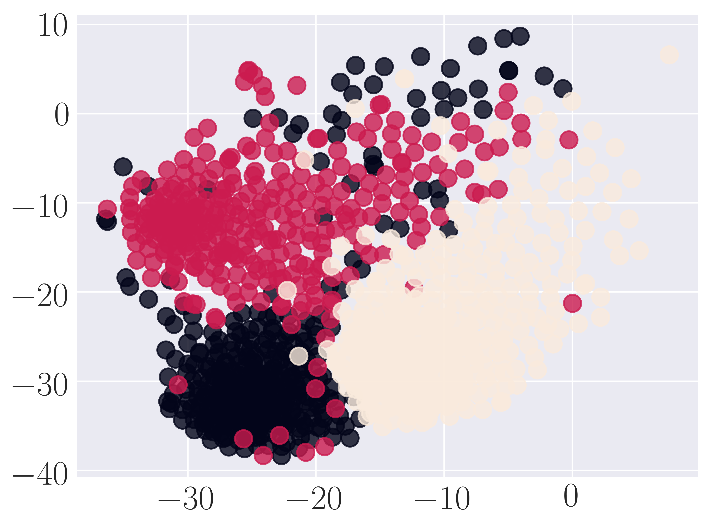

#### Visualization of SBM using HOPE
<p align="center">
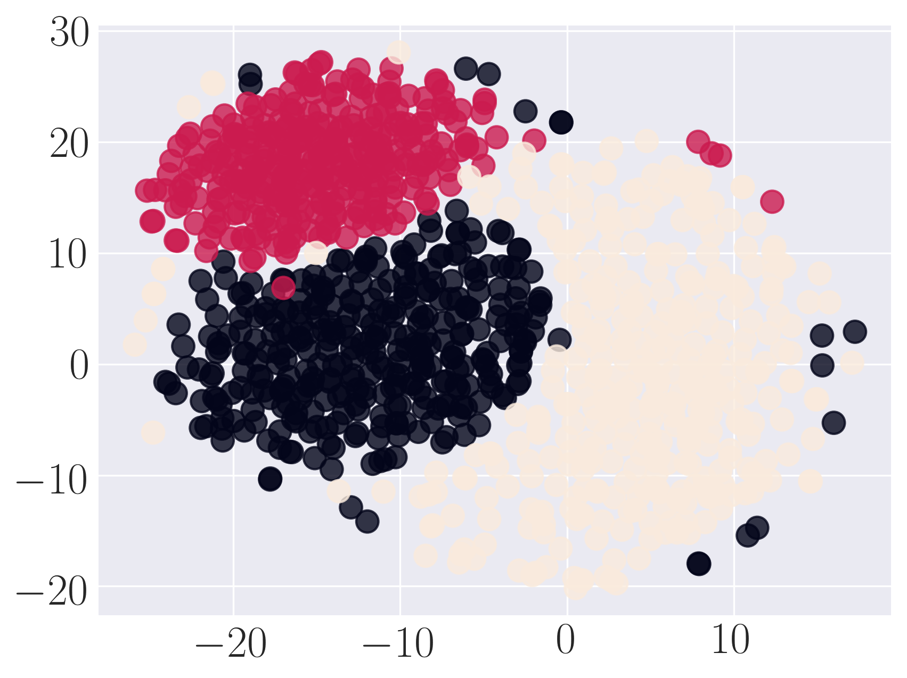

#### Visualization of SBM using Laplacian Eigenmaps
<p align="center">
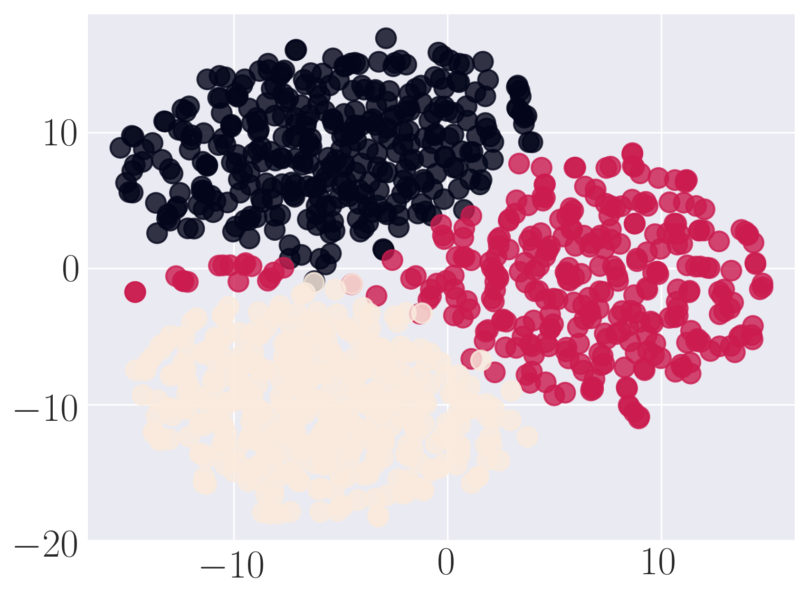

#### Visualization of SBM using Locally Linear Embedding
<p align="center">
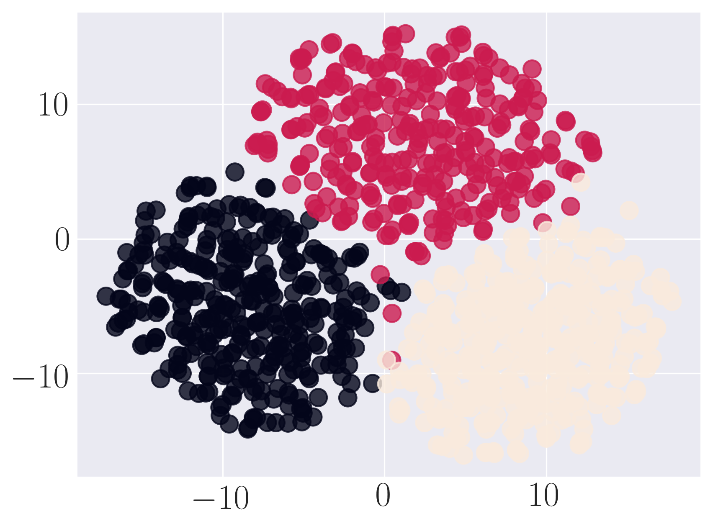

#### Visualization of SBM using node2vec
<p align="center">
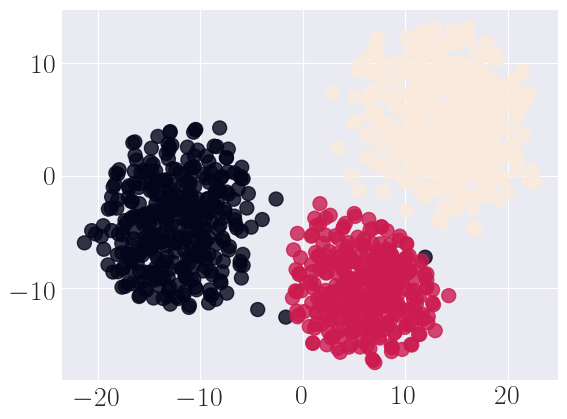

#### Visualization of SBM using SDNE
<p align="center">
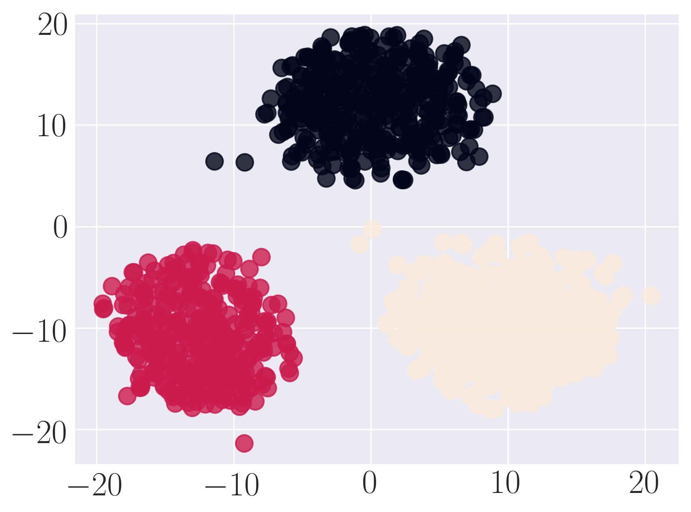

## Cite
    @article{goyal2017graph,
        title = "Graph embedding techniques, applications, and performance: A survey",
        journal = "Knowledge-Based Systems",
        year = "2018",
        issn = "0950-7051",
        doi = "https://doi.org/10.1016/j.knosys.2018.03.022",
        url = "http://www.sciencedirect.com/science/article/pii/S0950705118301540",
        author = "Palash Goyal and Emilio Ferrara",
        keywords = "Graph embedding techniques, Graph embedding applications, Python graph embedding methods GEM library"
    }


